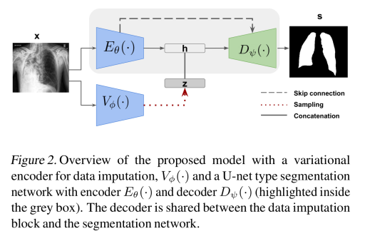

# README #

This is official Pytorch implementation of 
"[Lung Segmentation from Chest X-rays using Variational Data Imputation](https://arxiv.org/abs/2004.10076)", Raghavendra Selvan et al. 2020


### What is this repository for? ###

* Predict lung masks from CXRs
* Run and reproduce results in the paper
* v1.0

### How do I get set up? ###

* Basic Pytorch dependency
* Tested on Pytorch 1.3, Python 3.6 
* Predict using the pretrained model: 
python predict.py --data DATA_DIR --post --model saved_models/lungVAE.pt
* Download preprocessed CXR data [from here](https://drive.google.com/open?id=1_rWIRBF9o6VE6v8upf4nTrZmZ1Nw9fbD)
* Train the model from scratch: 
python train.py --data DATA_DIR
### Usage guidelines ###

* Kindly cite our publication if you use any part of the code
```
@article{raghav2020lungVAE,
 	title={Lung Segmentation from Chest X-rays using Variational Data Imputation},
	author={Raghavendra Selvan et al.},
 	journal={arXiv preprint arXiv:2020.00000,
	year={2020}
}

```

### Who do I talk to? ###

* raghav@di.ku.dk

### Thanks 
* For the Kaggle [data](https://www.kaggle.com/kmader/pulmonary-chest-xray-abnormalities)
